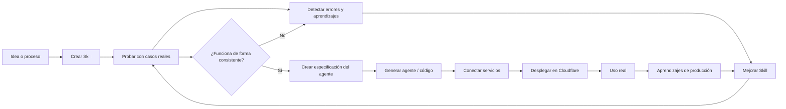

# Crear agentes: metodología de trabajo

Este repositorio documenta una forma sencilla de trabajar para pasar de una idea de automatización a un agente desplegable.

La idea principal es **no empezar programando el agente**.

Primero se define y prueba el comportamiento como una **skill**. Cuando la skill funciona de forma consistente con casos reales, se utiliza como base para construir el agente y desplegarlo fuera de ChatGPT.

## El proceso en una frase

**Idea → Skill → Pruebas → Aprendizajes → Skill validada → Especificación → Agente → Deploy → Producción → Mejora**

## Cómo trabajamos

### 1. Elegir un proceso concreto

Partimos de una tarea real de un negocio que tenga un objetivo claro.

Antes de pensar en código debemos entender:

- qué entra;
- qué debe hacer el sistema;
- qué resultado esperamos;
- qué decisiones debe tomar;
- qué herramientas o datos necesita;
- qué errores debemos evitar.

### 2. Crear una skill

La primera versión del proceso se construye como una skill.

La skill sirve para definir el comportamiento del futuro agente sin tener que desarrollar todavía toda la infraestructura.

Aquí definimos reglas, pasos, criterios, herramientas y límites.

### 3. Probarla con casos reales

No damos por buena la skill porque el prompt parezca correcto.

La usamos repetidamente con situaciones reales y observamos:

- dónde falla;
- qué interpreta mal;
- qué información le falta;
- qué reglas necesitan aclararse;
- qué pasos pueden simplificarse;
- qué decisiones deberían quedar documentadas.

### 4. Mejorar y repetir

Cada aprendizaje relevante se incorpora a la skill o a su documentación.

El ciclo es:

**probar → detectar problema → corregir → volver a probar**.

La skill se convierte poco a poco en la definición real del proceso.

### 5. Dar la skill por validada

No buscamos una perfección teórica. Buscamos que el proceso sea suficientemente estable y predecible para automatizarlo.

Cuando los casos habituales funcionan bien y conocemos las excepciones importantes, podemos pasar a la siguiente fase.

### 6. Convertir la skill en especificación del agente

La skill validada se utiliza como base para definir el agente independiente.

En esta fase concretamos:

- instrucciones del agente;
- entradas y salidas;
- herramientas y conectores;
- memoria y datos persistentes;
- permisos;
- gestión de errores;
- logs;
- ejecución manual, programada o por eventos.

### 7. Generar el agente

Con el comportamiento ya validado, se genera el código del agente.

La idea es poder apoyarnos en herramientas como Codex para transformar la especificación en una aplicación o servicio ejecutable.

### 8. Desplegarlo

El agente se despliega en infraestructura externa, inicialmente planteada sobre Cloudflare.

Desde allí podrá conectarse a los servicios que necesite: Google Drive, Sheets, Gmail, APIs, bases de datos u otros sistemas.

### 9. Aprender del uso real

El deploy no termina el proceso.

El agente debe registrar errores, excepciones y aprendizajes relevantes. Estos aprendizajes sirven para mejorar la siguiente versión de la skill y del propio agente.

## Tres piezas que no debemos confundir

### Skill

Define y prueba **cómo debe comportarse el proceso**.

### Agente

Ejecuta ese comportamiento con mayor autonomía y fuera del entorno de prueba.

### Infraestructura

Permite que el agente tenga ejecución, persistencia, conectores, memoria, logs y acceso a servicios externos.

## Regla importante

**No todas las skills tienen que convertirse en agentes.**

Una skill puede seguir siendo útil dentro de ChatGPT. Solo tiene sentido convertirla en agente cuando necesitamos autonomía, ejecución recurrente, eventos, integraciones, persistencia o uso por otras personas o sistemas.

## Documentos

- [`docs/01-flujo-de-trabajo.md`](docs/01-flujo-de-trabajo.md): el proceso explicado paso a paso.
- [`docs/02-cuando-pasar-a-agente.md`](docs/02-cuando-pasar-a-agente.md): criterios para decidir cuándo una skill está lista.
- [`docs/03-aprendizaje-y-versionado.md`](docs/03-aprendizaje-y-versionado.md): cómo mejorar el sistema conforme se prueba.
- [`templates/checklist-skill.md`](templates/checklist-skill.md): checklist sencilla para cada nueva skill.

## Estado del método

Esta metodología está en construcción.

El objetivo de este repositorio es documentar **cómo trabajamos realmente**, no diseñar de antemano una arquitectura perfecta. Conforme creemos y despleguemos agentes reales iremos modificando esta guía con lo que aprendamos.
